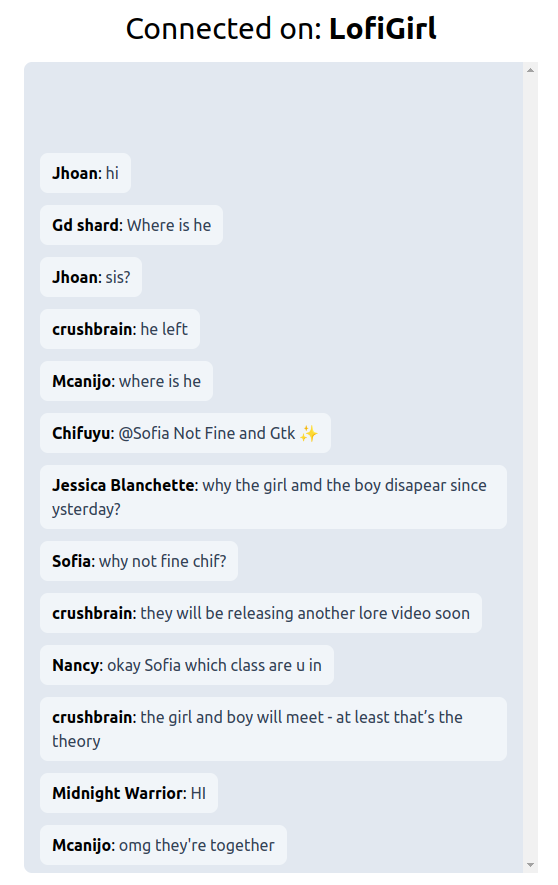

# Server Sent Events

## 🚀 Intro
This project is a sample of how to use Server Sent Events to get messages from a live chat on Youtube and send to client

## 👨‍💻 Technologies
- [Astro](https://astro.build/)
- [Svelte](https://svelte.dev/)
- [Tailwind](https://tailwindcss.com/)
- [Server Sent Events](https://developer.mozilla.org/en-US/docs/Web/API/Server-sent_events/Using_server-sent_events)
- [Express](https://expressjs.com/pt-br/)
- [Tubechat](https://github.com/zaacksb/tubechat)

## 📄 Licença

Esse projeto está sob a licença MIT. Acesse o link [LICENSE](https://mit-license.org/) para mais detalhes.

## 🌐 GitHub

O código-fonte da aplicação pode ser encontrado no GitHub: [Link do Projeto](https://github.com/nitoba/poll-voting)

## 📧 Contato

Em caso de dúvidas ou sugestões, entre em contato através do e-mail: [nito.ba.dev@gmail.com](mailto:nito.ba.dev@gmail.com).